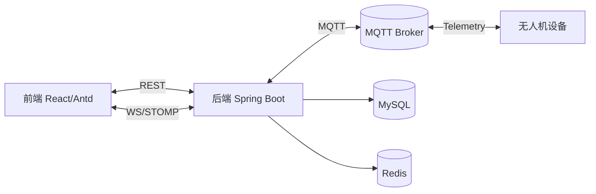
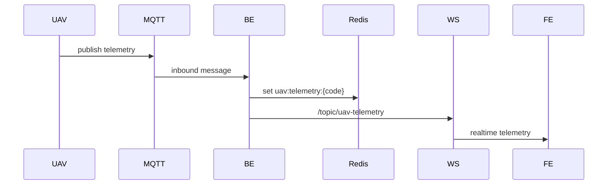
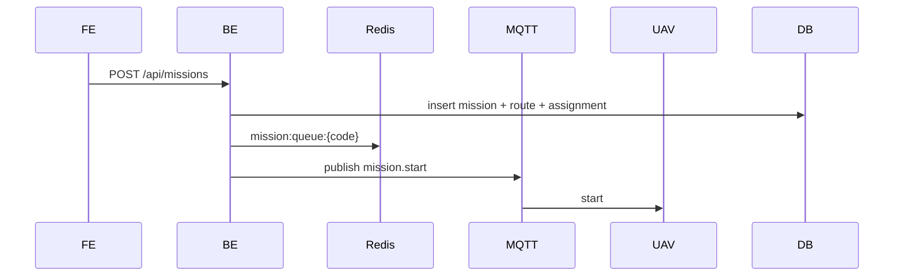
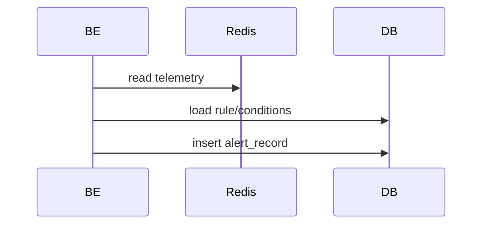
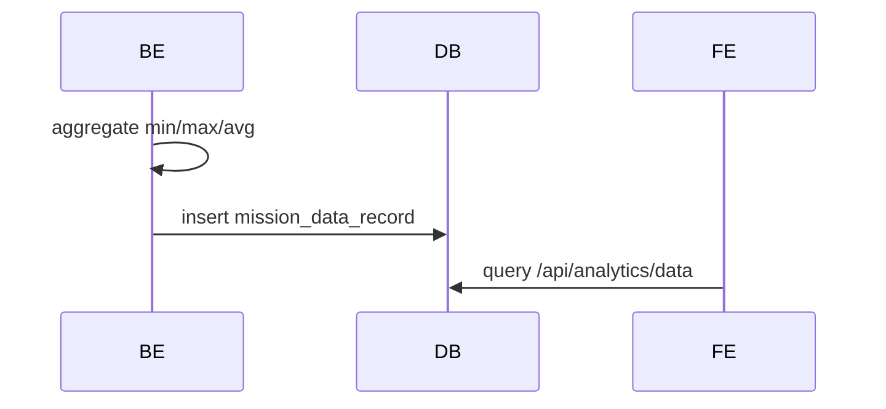

# 无人机环境监测平台软件系统详细设计论文（毕业论文级别）

## 摘要
本文基于 `uav-frontend` 与 `uav-backend` 的真实代码实现，对无人机环境监测平台的功能、架构、模块交互、接口实现、页面设计、数据库与缓存设计、MQTT 与 WebSocket 通信设计进行毕业论文级别的详尽说明。系统以“任务规划—遥测采集—告警触发—数据分析”为主线，围绕机队接入、任务调度、实时监控、告警规则、数据聚合与统计分析构建完整闭环。全文强调每个详细设计逻辑的参与模块、实现步骤与交互关系，并辅以关键时序与数据流说明。

---

## 0. 模块交互总览（系统级交互关系）

### 0.1 模块构成
- **前端模块**：AuthContext、Layout、Dashboard、FleetCenter、MissionCommander、Monitoring、DataAnalytics、ConfigCenter、AlertsCenter、PersonnelManagement
- **后端模块**：Auth、Security、Fleet、Mission、Monitoring、Alert、Analytics、ConfigCenter、MQTT、WebSocket
- **支撑系统**：MySQL、Redis、MQTT Broker、WebSocket 连接

### 0.2 关键模块间交互说明
1. **认证链路**：
   - 前端 `AuthContext` 调用 `/api/auth/*` 与后端 `AuthService` 交互
   - 后端 `TokenAuthenticationFilter` 解析 token 并注入 Security Context
2. **遥测链路**：
   - UAV → MQTT → 后端 `MqttConfig` → Redis → `TelemetryPushScheduler` → WebSocket → 前端
3. **任务链路**：
   - 前端创建任务 → 后端 `MissionService` 写入 DB + Redis 队列
   - 后端 `MissionQueueService` 调度并通过 `MqttCommandPublisher` 下发命令
4. **监控链路**：
   - 前端 Monitoring 页面订阅 WebSocket，展示实时指标
   - 后端 `TelemetryStatusMonitor` 解析遥测并处理状态/告警/聚合
5. **告警链路**：
   - 告警规则（AlertRule）由前端配置 → 后端保存
   - 遥测触发告警 → 写入 `alert_record` → 前端查询展示
6. **分析链路**：
   - 任务执行过程中 `MissionDataAggregator` 聚合指标
   - 任务结束写入 `mission_data_record` → 前端数据分析页面查询

---

## 1. 引言
无人机平台化管理涉及设备接入、实时遥测、任务调度、告警与数据分析等多维度能力。本文在真实工程代码基础上整理系统设计说明，强调“可落地实现”与“逻辑完整闭环”，用于毕业论文系统设计章节。

---

## 2. 系统总体架构

### 2.1 组件架构

### 2.2 分层结构
- **前端**：页面层（React）+ 服务层（Axios API）+ WebSocket 通信层 + AuthContext
- **后端**：Controller（接口层）+ Service（业务逻辑层）+ Mapper（数据库访问）+ 基础设施（MQTT/WebSocket/Redis）
- **数据层**：MySQL（持久化业务数据）、Redis（高频遥测/队列缓存）

---

## 3. 前端详细设计（页面级 + 模块交互）

### 3.1 技术栈与实现方式
- React 18 + TypeScript
- Ant Design UI 组件
- React Router 6
- Leaflet 地图
- Axios
- WebSocket (手写 STOMP)

### 3.2 全局布局与路由控制
- `MainLayout`：侧边栏（Menu）+ 顶部栏（Header）+ 内容区（Content）
- `App.tsx`：
  - 未登录仅允许 `/login`
  - 登录后重定向 `/dashboard`
  - `superadmin` 才展示“人员管理 / 配置中心 / 告警中心”

### 3.3 AuthContext（上下文设计）
**目标**：统一管理 token 与用户信息，驱动全局路由与权限控制。

**实现步骤**：
1. 启动时读取 `localStorage` 中 token
2. 若 token 存在 → 调用 `/api/auth/profile` 拉取用户信息
3. 登录成功时写入 token + 用户信息
4. 登出时清理 token 并调用 `/api/auth/logout`

### 3.4 API 层设计（http.ts + api.ts）
- `http.ts`：注入 Authorization、统一异常处理、401 清理 token
- `api.ts`：按业务模块封装 REST API
- `user.ts`：用户管理 API 独立封装

### 3.5 WebSocket/STOMP 设计
- 端点：`ws://localhost:8080/ws/uav-telemetry`
- CONNECT → SUBSCRIBE → MESSAGE
- 自动重连（4 秒）
- 订阅主题：
  - `/topic/uav-telemetry`
  - `/topic/uav-telemetry/{uavCode}`
  - `/topic/mission-updates`

---

### 3.6 页面详细设计（逐页模块、状态与交互）

#### 3.6.1 Login（登录页）
- **模块**：登录表单（用户名、密码）、登录按钮
- **状态**：`loading`
- **交互流程**：
  1. 表单提交 → `AuthContext.login`
  2. 调用 `/api/auth/login`
  3. 成功后跳转 `/dashboard`

#### 3.6.2 Dashboard（运行总览）
- **模块**：统计卡片区 + 任务动态摘要区
- **状态**：`summary`、`missions`
- **交互**：
  - `fleetApi.summary()` → 统计卡片
  - `missionApi.list()` → 任务摘要
- **渲染逻辑**：根据 `mission.status` 计算运行/排队数量

#### 3.6.3 FleetCenter（机队中心）
- **模块**：统计卡片区 / UAV 表格 / 接入弹窗
- **状态**：
  - `fleet`：UAV 列表
  - `summary`：统计值
  - `telemetryRef`：WebSocket 遥测缓存（Ref）
  - `telemetryVersion`：触发刷新
  - `wsConnected`：连接状态
- **交互流程**：
  1. 页面加载调用 `fleetApi.list`、`fleetApi.summary`、`configApi.sensors.list`、`userApi.list`
  2. WebSocket 推送遥测 → 更新 `telemetryRef`
  3. 5s 定时器清除超时遥测 → 离线显示
  4. 表单提交 → `fleetApi.register` → 刷新列表
- **模块联动**：表格和统计卡片都依赖 `telemetryRef` 与 `fleet` 状态

#### 3.6.4 MissionCommander（任务指挥）
- **模块**：任务列表 / 航线地图 / 任务抽屉 / 创建弹窗 / 航线弹窗
- **状态**：
  - `missions`、`selectedMissionIds`
  - `routeDraft`、`routeModalOpen`
  - `uavTelemetry`、`missionWsRef`
- **交互流程**：
  1. 页面加载调用 `missionApi.list`、`missionApi.types`、`fleetApi.available`、`userApi.list`、`alertApi.rules.list`
  2. Leaflet 点击地图 → 形成 `routeDraft`
  3. 创建任务 → `missionApi.create`
  4. 独立 WebSocket 订阅 `/topic/mission-updates` → 更新任务状态
  5. UAV 位置 → WebSocket `/topic/uav-telemetry` 更新地图标记
- **模块联动**：任务列表与地图互相驱动（选中任务 → 地图聚焦）

#### 3.6.5 Monitoring（实时监控）
- **模块**：运行任务列表 / 实时指标表格
- **状态**：`missions`、`missionTypes`、`metrics`、`telemetryMap`
- **交互流程**：
  1. 加载 RUNNING 任务 → `missionApi.list({status:['RUNNING']})`
  2. 获取配置中心指标 → `configApi.missionTypes.list` + `configApi.metrics.list`
  3. WebSocket 遥测 payload.data → 映射到指标表格

#### 3.6.6 DataAnalytics（数据分析）
- **模块**：查询表单 / 动态指标表格
- **状态**：`missionTypes`、`metrics`、`data`
- **交互流程**：
  1. 选择任务类型、时间范围 → `/api/analytics/data`
  2. 根据任务类型关联指标 → 动态列（min/max/avg）

#### 3.6.7 ConfigCenter（配置中心）
- **模块**：任务类型管理 / 指标管理 / 传感器管理
- **交互流程**：CRUD 操作调用 `/api/catalog/*`

#### 3.6.8 AlertsCenter（告警中心）
- **模块**：规则列表 / 告警记录 / 规则编辑弹窗
- **交互流程**：
  - `alertApi.rules.list` 获取规则
  - `alertApi.records.list` 获取记录
  - 处理记录 → `alertApi.records.process`

#### 3.6.9 PersonnelManagement（人员管理）
- **模块**：用户列表 / 新增用户弹窗
- **交互流程**：
  - `userApi.list`、`userApi.create`、`userApi.delete`、`userApi.resetPassword`

---

## 4. 后端接口逐条详细实现（Controller → Service → Mapper/DB/Redis/MQTT）

### 4.1 AuthController
#### POST /api/auth/login
- **Controller**：`AuthController.login`
- **Service**：`AuthService.login`
- **DB**：`users`、`auth_tokens`
- **流程**：
  1. 校验请求体（@Valid）
  2. 查询 `users`（UserMapper）
  3. BCrypt 校验密码
  4. 校验 `status` 是否 ACTIVE
  5. 更新 `last_login_at`
  6. 生成 token → SHA-256 hash → 插入 `auth_tokens`

#### GET /api/auth/profile
- **Controller**：`AuthController.profile`
- **Service**：`AuthService.findUserByToken`
- **DB**：`auth_tokens` + `users`

#### POST /api/auth/logout
- **Controller**：`AuthController.logout`
- **Service**：`AuthService.logout`
- **DB**：更新 `auth_tokens.revoked_at`

---

### 4.2 UserController
#### GET /api/users
- **Mapper**：`UserMapper`
- **DB**：查询 `users`，条件 `status=ACTIVE`

#### POST /api/users
- **Service 逻辑**：
  - 校验 username/password
  - 校验唯一性
  - BCrypt 加密密码
  - 插入 users

#### DELETE /api/users/{id}
- **逻辑**：
  - 若删除 SUPERADMIN：只允许删除当前登录用户，且必须至少保留 1 名 SUPERADMIN
  - 否则直接删除

#### POST /api/users/{id}/reset-password
- **逻辑**：密码重置为 123456

---

### 4.3 FleetController
#### GET /api/fleet/summary
- **Service**：`FleetService.summary`
- **逻辑**：遍历所有 UAV → `TelemetryService.resolveStatus` 统计在线/告警

#### GET /api/fleet
- **Service**：`FleetService.list`
- **DB**：分页查询 `uav_devices`
- **状态过滤**：根据 Redis 遥测判断在线状态

#### GET /api/fleet/available
- **逻辑**：仅返回 ONLINE UAV

#### POST /api/fleet
- **Service**：`FleetService.register`
- **流程**：
  - 校验 uavCode 唯一
  - 校验 pilotUsername 存在
  - 插入 `uav_devices`
  - 插入 `uav_sensors`

---

### 4.4 MissionController
#### GET /api/mission-types
- **DB**：查询 `mission_types`

#### GET /api/missions
- **Service**：`MissionService.list`
- **DB**：查询 `missions`

#### POST /api/missions
- **Service**：`MissionService.create`
- **流程**：
  1. 生成 `missionCode`
  2. 校验飞行员
  3. 写入 `missions`（状态 QUEUE）
  4. 保存 `mission_route_points`
  5. 保存 `mission_uav_assignments`
  6. 写入 Redis 队列 `mission:queue:{missionCode}`
  7. WebSocket 推送任务状态

#### PATCH /api/missions/{code}
- 更新 progress

#### POST /api/missions/{code}/interrupt
- 更新 status=INTERRUPTED
- 通过 MQTT 下发 interrupt

---

### 4.5 MonitoringController
- GET /api/monitoring/tasks
- GET /api/monitoring/tasks/{taskCode}
- POST /api/monitoring/tasks/{taskCode}/rules
- DELETE /api/monitoring/tasks/{taskCode}/rules/{ruleId}

**注意**：前端删除规则路径与后端接口路径存在差异，需统一。

---

### 4.6 AlertController
- GET /api/alerts/rules
- POST /api/alerts/rules
- PUT /api/alerts/rules/{id}
- DELETE /api/alerts/rules/{id}
- GET /api/alerts/records
- PUT /api/alerts/records/{id}/process

---

### 4.7 AnalyticsController
- GET /api/analytics/data

**注意**：前端还调用 `/api/analytics/definitions` 和 `/api/analytics/task-executions`，后端当前未提供 Controller 实现。

---

## 5. 数据库设计（字段级、索引、约束）

### 5.1 V1__init.sql（主业务表）
- `users`
  - id (PK, AUTO)
  - username (UNIQUE)
  - password_hash
  - role ENUM('SUPERADMIN','OPERATOR')
  - status ENUM('ACTIVE','DISABLED')
  - last_login_at
  - 索引：UNIQUE(username)

- `auth_tokens`
  - id (PK)
  - user_id (FK)
  - token_hash (UNIQUE)
  - expires_at
  - revoked_at
  - 索引：idx_tokens_user(user_id), idx_tokens_hash(token_hash)

- `uav_devices`
  - id (PK)
  - uav_code (UNIQUE)
  - model / pilot_name / status / battery_percent
  - last_heartbeat_at
  - 索引：idx_uav_status(status)

- `missions`
  - id (PK)
  - mission_code (UNIQUE)
  - name / mission_type / pilot_name
  - status / priority / progress
  - 索引：idx_missions_status(status)

- `mission_route_points`
  - id (PK)
  - mission_id (FK)
  - seq, lat, lng, altitude
  - 索引：idx_route_mission_seq(mission_id, seq)

- `mission_uav_assignments`
  - id (PK)
  - mission_id (FK)
  - uav_id (FK)
  - assigned_at
  - 索引：idx_assign_mission(mission_id)

- `mission_events`
  - id (PK)
  - mission_id (FK)
  - event_type
  - occurred_at
  - 索引：idx_events_mission(mission_id, occurred_at)

- `monitoring_tasks` / `monitoring_rules`
- `analytics_definitions`
- `task_executions`

### 5.2 mission-metric-sensor.sql（配置中心）
- `sensor_types`（sensor_code UNIQUE）
- `metric_definitions`（metric_code UNIQUE）
- `metric_sensors`（metric_id + sensor_type_id 索引）
- `mission_type_metrics`（mission_type_id + metric_id 索引）

### 5.3 代码中存在但迁移未包含的表
- `uav_sensors` / `uav_sessions` / `uav_telemetry`
- `alert_rule` / `alert_rule_condition` / `alert_record`
- `mission_data_record`

**说明**：以上表在实体类中已引用，实际部署需补齐迁移脚本。

---

## 6. Redis 缓存与任务队列设计
- `uav:telemetry:{uavCode}`：遥测缓存（TTL=2s）
- `mission:queue:{missionCode}`：任务队列（TTL=10min）

---

## 7. MQTT 与 WebSocket 通信设计
- MQTT Telemetry：`uav/{uavCode}/telemetry`
- MQTT Command：`uav/{uavCode}/command`
- WebSocket 端点：`/ws/uav-telemetry`
- WebSocket Topics：
  - `/topic/uav-telemetry`
  - `/topic/mission-updates`

---

## 8. 关键流程时序图

### 8.1 遥测采集

### 8.2 任务调度

### 8.3 告警触发

### 8.4 数据分析

---

## 9. 结论
系统形成“任务规划—遥测—告警—分析”完整闭环，具备实时性与可扩展性。通过本文详尽的页面、接口、数据库与通信设计描述，可为论文撰写与系统完善提供完整依据。
